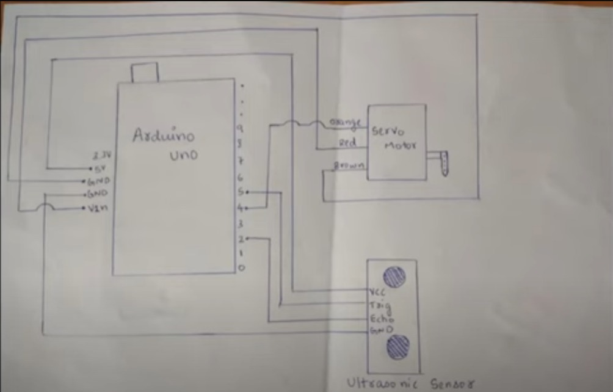

# Automatic Water Tap Project  
This repository contains the code and documentation for an **Automatic Water Tap System**. The project uses an ultrasonic sensor and a servo motor to create a hands-free tap mechanism, ensuring hygiene and water conservation.


## Features  
- Detects objects within a specified range using an ultrasonic sensor.  
- Rotates a servo motor to open and close the tap automatically.  
- Designed to be simple, affordable, and effective.  


## Components Used  
- Arduino Uno  
- Ultrasonic Sensor (HC-SR04)  
- Servo Motor (SG90 or similar)  
- Jumper Wires  
- Power Supply  


## Circuit Diagram  



## Code  
The Arduino code for the project is located in the `Code` folder. To upload the code to your Arduino board:  
1. Open the `.ino` file in the Arduino IDE.  
2. Select the correct board and port under **Tools > Board** and **Tools > Port**.  
3. Upload the code.  


## How It Works  
1. The ultrasonic sensor continuously measures the distance to the nearest object.  
2. When an object (e.g., a hand) is detected within a predefined range (e.g., <10 cm), the servo motor rotates to open the tap.  
3. Once the object moves out of range, the servo motor rotates back to close the tap.  


## Installation Instructions  
1. Clone this repository:  
   ```bash
   git clone https://github.com/<your-username>/automatic-water-tap.git
2. Open the project in the Arduino IDE.
3. Follow the circuit diagram to set up the hardware.
4. Upload the code to the Arduino board.


## Challenges and Learnings
- Challenges: Initial difficulties with the ultrasonic sensor readings and servo motor movement.
- Learnings: Improved understanding of Arduino programming and hardware troubleshooting.


## Contributors
- Abiodun Oluwamurewa - Project Lead
- Ewansiha Victory - Assitanct Project Lead
- All members of Group B 

